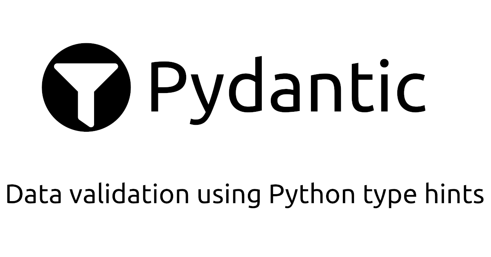

# DATACLASSES


1. ## I. INTRODUCTION 
What is a data class?

A data class is a class that contains many data. It gives a flexible and predictable way to store data, compare data and sort data.

Data classes in python allow you to write shorter code and initialize, print and compare data much more easily.Classes are a combination of two things: behavior in the form of methods and data in the form of class attributes. They are blueprint for objects, they form the basis of object-oriented programming and developers use them in a million different ways.

Some classes are most containers of behavior, for example a class that allows you to draw all kinds of the shape on the screen or a class that provides password hashing functionality. Other classes act more as containers of data. Think of class for representing a vehicle in a vehicle registration system or a class for represeting a polygonal meshh in a graphic system

When working with behavior container class, you might use things like inheritance to change the behavior or use design patterns such as the strategy. You probably also won't have that any different instances of that class in application a class that behaves more like a data container is often used differently, you may need to create many instances you want to order them, compare them easily, inspect the data that's in them etc... 

Regular bar bone cLasses don't really provide a lot of
useful functionality for such data oriented classes that's why some programming
languages provide a more data-oriented variant of a class. For example c-sharp has a stock type that's much ie a class but it's more oriented towar representing data structures and since version 3.7 python has a data classes module so how are data classes different from regular classes. 

First data class have a built-in initialize to help quickly fill an object with
data. There are easy ways to print,compare and order data, we can create data that's read-only and they're today free.

## II. PRESENTATION OF THE CONCEPT OF DATA CLASSES

Introduced in Python 3.7 following PEP 557, the data class mechanism is a small 
toolbox to simplify the writing of some basic elements of the class definition, 
and thus improve their readability.


1. **First look at a basic class** 

These "few basic elements" of the classes are in fact their attributes. So if we want to define a class that pretty much only hosts attributes, we can write it in only a few lines (in the simplest form:the number of attributes + 2 lines) while having been able to define some basic aspects of the behavior of future instances (about their string representation,their mutability, and other things).

Let's imagine that we have to write a class Foo whose instances will contain only three attributes a, b and c. We will have to write at least one __init__ method:
  
```python
class Foo:
    def __init__(self,a,b,c): 
        self.a=a
        self.b=b
        self.c=c
Foo(1,"b",True).__dict__ 
{'a':1,'b':'b','c':True}

```

This type of __init__ method, where we do nothing but initialize attributes with the data received by the constructor, is quite common and can be repeated several times in a code. It's not that it's very long, but in this canonical case already. 

2. **The look of a data class** 
Data class can lighten the code. it's creation is done via a 
decorator of the same name that must be imported, like all the tools that will be linked to this notion, from the data classes module. The code allowing to create the data class Foo is then :

```python
from dataclasses import dataclass

@dataclass
class Foo:
        a:int
        b:str
        c:bool
Foo(1,"b",True).__dict__
{'a':1,'b':'b','c': True}
```

As we can see, creating a data class is done by simply listing the attributes that compose it. But it is important to note that this system requires us to type these attributes, using the variable annotation syntax available since PEP 526. Writing in data class form has the advantage of guaranteeing the presence of the typing, and we have the impression of reading a clearer interface than before.


3. **The validation issue**

Unfortunately, annotations in data classes are not used for validation. It is therefore quite possible to disregard the intention of the class creator and write :

```python     
from dataclasses import dataclass

@dataclass
class Foo:
        a:int
        b:str
        c:bool
Foo(1,2,3).__dict__
{'a':1,'b':2,'c': 3}
```

This behavior respects that of PEP 484 and 526, for which these annotations are 
primarily created to be checked when type checkers ( mypy for example) are run on the source code, not during normal executions of our code (which has the advantage of not slowing down execution in production).

Video for a better explanation [here](https://youtu.be/vBH6GRJ1REM)

## III. COMPARISONS

### 1. EQUALITY
So we have seen how to create data classes but now we want to check out how 
equality between two different instances of a data class is handled.
```python
from dataclasses import dataclass
from typing import Optional
@dataclass
class Pizza:
        name:str
        size:str
        price_in_euro:Optional[int]=None
        base:Optional[str]=None
        
pizza_one = Pizza(name="Peperoni",size="large",price_in_euro=20,base="tomato")
pizza_two= Pizza(name="Peperoni",size="large",price_in_euro=20,base="tomato")
pizza_three= Pizza(name="Peperoni",size="large",base="tomato")
pizza_four= Pizza(name="Mexican",size="small",price_in_euro=10,base="fresh cream")
```
As you can see we have a class Pizza which has for attribute. Right after we have four kind of Pizza. we want to check for their equality 
```python
print(f"Obviously not equal:{pizza_one==pizza_four}")
print(f"Hopefully equal:{pizza_one==pizza_two}")
print(f"Maybe equal:{pizza_one==pizza_three}")
```
Let's run the code:
```python
i3/PycharmProjects/pythonProject/lesCodes.py"
Obviously not equal:False
Hopefully equal:True
Maybe equal:False
```
    
When we run this then luckily for us the pizza_one and pizza_four are not 
considered to be equal.

When we also checked that hopefully since both this the pizza_one and the pizza-two have the same information then they should represent the same type of data and as we wish it's equal. Actually this you don't get for typical classes if you use an usual class even though they have the same attributes,they are automatically set to be equal. I think the default behavior is that they are only equal if they represent the same object in memory so typically data with exactly the same attributes should be considering to be equal.

"The pizza_one== pizza-three" return "False" because it was missing one attribute so the third instance is considered to be different to the first one, but it's more realistic to be "True" because both pizzas have the same composition, the price is supposed to be the same

To bring this precision, we need to do this:
```python
from dataclasses import dataclass
from typing import Optional
@dataclass
class Pizza:
        name:str
        size:str
        price_in_euro:Optional[int]=None
        base:Optional[str]=None
        
        def __eq__(self,other):
	        if other.__class__ is not self.class__:
		        return False
	        return (self.base == other.base)
```
### 2. ORDERING 
When working with data, we often need to sort values. In our scenario, we may want
to sort our different people based on some attribute. For that, we'll use the
order parameter of the dataclass decorator mentioned above which enables sorting
in the class:
```python

from dataclasses import dataclass
@dataclass(order=True)
class Person():
    name:str
    age:int
    height:float
    email:str
```
When the order parameter is set to True, it automatically generates the 
__lt__ (less than), __le__ (less or equal), __gt__ (greater than), and 
__ge__ (greater or equal) methods used for sorting.
Let's instantiate our marcelle and patrick objects to see if one is greater than
the other:
```python
marcelle= Person('marcelle', 22, 1.62,"marcelle@gmail.com")
patrick= Person("patrick", 34, 1.85,"pat@gmail.com")
print(marcelle>patrick)
```

```python
False
```
Python tells us that marcelle is not greater than patrick, but based on what 
criteria? The class compares the objects as tuples containing their attributes,
like this:

```python
print(('marcelle', 22, 1.62,"marcelle@gmail.com")>("patrick", 34, 1.85,"pat@gmail.com"))
```
```python
False
```
As the letter "m" comes before "P", it says the marcelle < patrick. If the names were the
same, it would move to the next element in each tuple. As it is, it's comparing 
the objects alphabetically. Although that can make some sense depending on the 
problem we're dealing with, we want to be able to control how the objects will be
sorted.

To achieve that, we'll take advantage of two other features of the dataclasses 
module.

The first is the field function. This function is used to customize one attribute
of a data class individually, which allows us to define new attributes that will
depend on another attribute and will only be created after the object is instantiated.

In our sorting problem, we'll use field to create a sort_index attribute in our 
class. This attribute can only be created after the object is instantiated and is
what data classes uses for sorting:
```python
from dataclasses import dataclass, field
@dataclass(order=True)
class Person():
    sort_index:int=field(init=False,repr=False)
    name:str
    age:int
    height:float
    email:str
```
The two arguments that we passed as False state that this attribute isn't in the __init__ and that it shouldn't be displayed when we call __repr__. There are other parameters in the field function that you can check in the documentation.

After we've referenced this new attribute, we'll use the second new tool: the __post_int__ method. As it goes by the name, this method is executed right after the __init__ method. We'll use __post_int__ to define the sort_index, right after the creation of the object. As an example, let's say we want to compare people based on their age. Here's how:
```python
@dataclass(order=True)
class Person():
    sort_index: int = field(init=False, repr=False)
    name: str
    age: int
    height: float
    email: str

    def __post_init__(self):
        self.sort_index = self.age
```
If we make the same comparison, we know that marcelle is younger than patrick:
```python
marcelle= Person('marcelle', 22, 1.62,"marcelle@gmail.com")
patrick= Person("patrick", 34, 1.85,"pat@gmail.com")
print(marcelle>patrick)
```
```python
False
```
If we wanted to sort people by height, we'd use this code:
```python
@dataclass(order=True)
class Person():
    sort_index: float = field(init=False, repr=False)
    name: str
    age: int
    height: float
    email: str

    def __post_init__(self):
        self.sort_index = self.height
marcelle= Person('marcelle', 22, 1.62,"marcelle@gmail.com")
patrick= Person("patrick", 34, 1.85,"pat@gmail.com")
print(marcelle<patrick)
```
```python
True
```
Marcelle is not taller than Patrick. Notice that we set sort_index as a float.

We were able to implement sorting in our data class without the need to write multiple methods

### 3. IMMUTABILITY
Another parameter of @dataclass that we mentioned above is frozen. When set to True, frozen doesn't allow us to modify the attributes of an object after it's created.

With frozen=False, we can easily perform such modification:
```python
@dataclass()
class Person():
    name: str
    age: int
    height: float
    email: str
marcelle= Person('marcelle', 22, 1.62,"marcelle@gmail.com")
print(marcelle)
```
```python
Person(name='marcelle', age=22, height=1.62, email='marcelle@gmail.com')
```
We created a Person object and then modified the age attribute without any problems.

However, when set to True, any attempt to modify the object throws an error:
```python
@dataclass(frozen=True)
class Person():
    name: str
    age: int
    height: float
    email: str
marcelle= Person('marcelle', 22, 1.62,"marcelle@gmail.com")

marcelle.age=42
print(marcelle)
```
```
---------------------------------------------------------------------------

FrozenInstanceError                       Traceback (most recent call last)

~\AppData\Local\Temp/ipykernel_5540/2036839054.py in <module>
      8 marcelle = Person('marcelle', 25, 1.85, 'marcelle@gmail.com')
      9
---> 10 marcelle.age = 42
     11 print(marcelle)

<string> in __setattr__(self, name, value)

FrozenInstanceError: cannot assign to field 'age'
```
Notice that the error message states FrozenInstanceError.

There's a trick that can modify the value of the immutable data class . If our class contains a mutable attribute, this attribute can change even though the class is frozen. This may seem like it doesn't make sense, but let's look at an example.

Let's recall the People class that we created earlier in this article, but now let's make it immutable:
```python
@dataclass(frozen=True)
class People():
    people: List[Person]

@dataclass(frozen=True)
class Person():
    name: str
    age: int
    height: float
    email: str
```
We then create two instances of the Person class and use them to create an instance of People that we'll name two_people:
```python
marcelle= Person('marcelle', 22, 1.62,"marcelle@gmail.com")
patrick= Person("patrick", 34, 1.85,"pat@gmail.com")

both= People([marcelle,patrick])
print(both)
```
```python
People(people=[Person(name='marcelle', age=22, height=1.62, email='marcelle@ggmail.com'), Person(name='patrick', age=34, height=1.85, email='pat@gmail.com')])
```
The people attribute in the People class is a list. We can easily access the values in this list in the two_people object:
```python
print(two_people.people[0])
```
```python
Person(name='marcelle', age=22, height=1.62, email='marcelle@gmail.com')
```
So, even though both Person and People classes are immutable, the list is not, which means we can change the values in it:
```python
both.people[0] = Person('marcelle', 22, 1.62, 'marcelle@gmail.com')
print(both.people[0])
```
```python
Person(name='marcelle', age=42, height=1.62, email='marcelle@ggmail')
```
Notice that the age is now 35.

We didn't change the attributes of any object of the immutable classes, but we replaced the first element of the list with a different one, and the list is mutable.

Keep in mind that all the attributes of the class should also be immutable in order to safely work with immutable data classes.

To have a better explanation of all of it, you can check an very instructive video [here](https://youtu.be/vRVVyl9uaZc) 


## IV.POSSIBLE ALTERNATIVE
**1. PYDANTIC**



Why should I actually go and use it?

* **Plays nicely with your IDE/linter/brain**

There's no new schema definition micro-language to learn. If you know how to use Python type hints, you know how to use pydantic. Data structures are just instances of classes you define with type annotations, so auto-completion, linting, mypy, IDEs (especially *PyCharm*), and your intuition should all work properly with your validated data.

* **Dual use**

Pydantic's *BaseSettings* class allows pydantic to be used in both a "validate this request data" context and in a "load my system settings" context. The main differences are that system settings can be read from environment variables, and more complex objects like DSNs and Python objects are often required.

* **Fast**

Pydantic has always taken performance seriously, most of the library is compiled with cython giving a ~50% speedup, it's generally as fast or faster than most similar libraries.

* **Validate complex structures**

Use of recursive pydantic models, typing's standard types (e.g. List, Tuple, Dict etc.) and validators allow complex data schemas to be clearly and easily defined, validated, and parsed.

* **Extensible**

Pydantic allows custom data types to be defined or you can extend validation with methods on a model decorated with the validator decorator.

* **Dataclasses integration**

As well as BaseModel, pydantic provides a dataclass decorator which creates (almost) vanilla Python dataclasses with input data parsing and validation.

Source: [https://docs.pydantic.dev/](https://docs.pydantic.dev/)

For a deeper explanation about the use of pydantic, click on this link 
[https://youtu.be/Vj-iU-8_xLs](https://youtu.be/Vj-iU-8_xLs)

## **V. DATA ANALYSIS USE CASE**
### 1. Using dataclass to create a database
Python data classes can create database models by using an Object-Relational Mapping (ORM) library such as SQLAlchemy or Tortoise-ORM. These libraries provide a way to map Python classes to database tables and to perform CRUD (Create, Read, Update, Delete) operations on the data in the tables through the class instances.

SQLAlchemy, for example, is a popular library that provides a powerful ORM system for Python. It allows you to define Python classes that correspond to database tables and then use those classes to interact with the data in the tables.
* **Declarative base** 

SQLAlchemy’s declarative base is a base class for declarative ORM (Object-Relational Mapping) models in SQLAlchemy. It provides a convenient way to define the structure of a database table in terms of Python classes and allows for the creation and manipulation of rows in those tables through instances of those classes.

It is often used in conjunction with Python data classes, which provide a simple way to define classes with a specific set of fields and types, and with inheritance, which allows for the reuse of standard functionality across related classes. By using the declarative base with data classes and inheritance, developers can define the structure of their database tables in a clear and organized way, while also taking advantage of the powerful features provided by SQLAlchemy.

Here is an example of how you might use a data class to define a database model in SQLAlchemy:
```python
from dataclasses import dataclass
from sqlalchemy import Column, Integer, String
from sqlalchemy.ext.declarative import declarative_base
Base = declarative_base()
@dataclass
class Person(Base):
    __tablename__ = 'person'
    id = Column(Integer, primary_key=True)
    name = Column(String)
    age = Column(Integer)
```
In this example, the Person class is defined as a data class, and it is also inherited from declarative_base() which is provided by SQLAlchemy. The __tablename__ attribute is used to specify the name of the table in the database that the class maps to. The id, name, and age attributes are defined as columns, and their types are specified using the Column class provided by SQLAlchemy. The id is also defined as the primary key for the table.

Once the class is defined, you can use it to create, read, update and delete data in the person table in the database.
```python
from sqlalchemy import create_engine
engine = create_engine('sqlite:///test.db')
Base.metadata.create_all(bind=engine)
```
This creates a database and the table ‘person’ using the data class Person. You can also create instances of the class, set their attributes and add them to the database.
```python
Session = sessionmaker(bind=engine)
session = Session()
p = Person(name="John", age=30)
session.add(p)
session.commit()
```
You can also query the data from the database using SQLAlchemy’s powerful query API.
```python
all_persons = session.query(Person).all()
print(all_persons)
```
This way, data classes can be used in conjunction with an ORM library like SQLAlchemy to define and interact with database models in a simple and efficient manner.

* **Separate model file**

In production-level code, you will not be doing the above. You will be separating your model and your CRUD operations. We will look at such an example next :

Create a file my_model.py and add the following code :
```python
from dataclasses import dataclass
from sqlalchemy import Column, String, create_engine
from sqlalchemy.ext.declarative import declarative_base
Base = declarative_base()
@dataclass
class User(Base):
    __tablename__ = "users"
    name: str
    email: str
    id = Column(String, primary_key=True)
engine = create_engine("sqlite:///mydb.sqlite")
Base.metadata.create_all(engine)
```
This example defines a User class with name and email fields and an id primary key. It then creates a SQLite database named mydb.sqlite and creates a table called "users" with the columns defined by the User class.

You can then use the class to perform CRUD operation on the table using SQLAlchemy’s ORM (Object-Relational Mapping) functions like ```python session.add(user) session.commit()```

* **Performing CRUD operations**

Create a new Python file and import the necessary modules:
```python
from sqlalchemy import create_engine
from sqlalchemy.orm import sessionmaker
from my_models import Base, User
```
Here, my_models is the module where you have defined the User class and Base is the declarative base.

Create a new SQLAlchemy engine:
```python
engine = create_engine("sqlite:///mydb.sqlite")
```
This creates a new SQLite database named *“mydb.sqlite”*. You can also use other database backends like PostgreSQL, MySQL, etc.

Create the database tables:
```python
Base.metadata.create_all(engine)
```
This creates the “users” table in the SQLite database using the User class defined in the *my_models module*

Create a new session:
```python
Session = sessionmaker(bind=engine)
session = Session()
```
The sessio nmaker function creates a new session factory, which is used to create new sessions. The bind argument specifies the engine to use for the session.

Add a new user to the session:
```python
user = User(name="Paule Marcelle", email="marcelle@gmail.com", id="1")
session.add(user)

```
This creates a new User object and adds it to the session.

Commit the transaction:
```python
session.commit()
```
This writes the new user to the database.

Close the session:
```python
session.close()
```
This closes the session and releases any resources held by the session.

You can also use the ``` flush()```method instead of the ```commit()``` method if you want to write changes to the database but keep the session open.

You can also perform other CRUD operations like ```session.query(User).filter(User.name == 'Paule Marcelle').first()``` to retrieve data, ```session.query(User).filter(User.name == 'Paule Marcelle').delete()``` to delete data and ```session.query(User).filter(User.name == 'Paule Marcelle').update({'name': 'Pat Rick'})``` to update the data.

* **Querying the database**

Once you have added data to the database using SQLAlchemy’s ORM, you can query the data using the session.query() method. Here's an example of how you might retrieve all the users from the "users" table:
```python
users = session.query(User).all()
for user in users:
    print(user.name, user.email)
```
This retrieves all the rows from the “users” table and prints out the name and email of each user.

You can also use the filter() method to retrieve specific rows based on certain criteria. For example, to retrieve the user with an id of 1:
```python
user = session.query(User).filter(User.id == "1").first()
```
You can also use the ```first()```, ```one()```, ```scalar()``` method to retrieve data. ```first()``` method returns the first row that matches the query, ```one()``` returns one and only one row, raises an error if multiple rows are returned, and ```scalar()``` returns the value of the first column of the first row.

You can also use ```count()``` to count the number of rows in the table, ```limit()``` to limit the number of rows returned, ```offset()``` to skip a certain nuumber of rows by one or more columns and many more.

Source: [https://smorbieu.gitlab.io/data-classes-in-python/](https://smorbieu.gitlab.io/data-classes-in-python/)


## **VI.CONCLUSION**
Data classes are a new way to define classes in Python.

Since the resulting classes are regular Python classes, we can take advantage of their benefits: implement some methods and use the autocomplete features provided by IDEs for instance.

Their syntax is more concise, and they generate automatically some methods such as __repr__, __str__ and __eq__.
They can easily be declared as frozen, allowing for instance to use them as keys of a dictionary (the __hash__ method is generated automatically in this case).

This new feature is particularly interesting for data science applications because we always have to define data entities and manipulate them. It makes code more readable, less tedious to write and provides static type checking eases.


